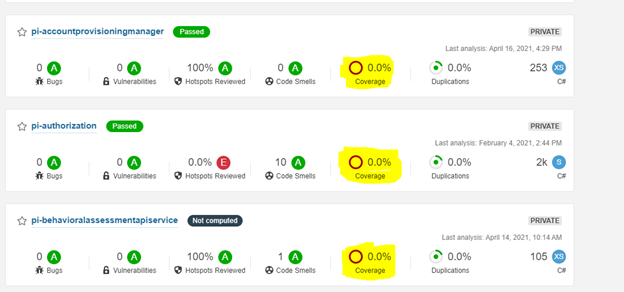

## **How do we generate and display code coverage?**

We rely on coverlet to generate a code coverage opencover.xml file which 
sonarcloud interprets and displays. This is executed as a part of our CI
process. The steps of this process are as follows:

1.  In the circleci folder, within the config.yml, Sonar Scanner is started.

  `dotnet-sonarscanner begin`

2.  Included in this command is the location that sonar will look for
    the code coverage report

  `/d:\"sonar.cs.opencover.reportsPaths=**\TestResults\**\coverage.opencover.xml"`

3.  Then, the solution is built, generating the appropriate respective
    dlls and pdbs

  `dotnet build`

4.  Afterwards, the test suite gets executed along with instructions for
    coverlet to generate the code coverage report (in opencover
    format). Two examples of how we currently do this are shown below

    `dotnet test --settings coverlet.runsettings --no-restore --no-build`

    With a coverlet.runsettings xml file specifying at minimum, format.
    Additional runsetting options can be found [here](https://docs.microsoft.com/en-us/visualstudio/test/customizing-code-coverage-analysis?view=vs-2017)

    ```
    <?xml version="1.0" encoding="utf-8" ?>
    <RunSettings>
      <DataCollectionRunSettings>
        <DataCollectors>
          <DataCollector friendlyName="XPlat Code Coverage">
            <Configuration>
              <Format>opencover</Format>
            </Configuration>
          </DataCollector>
        </DataCollectors>
      </DataCollectionRunSettings>
    </RunSettings>
    ```                                      

    Or alternatively, this command explicitly targets a specific test
    project.

    `coverlet <target test dll> --target "dotnet" --targetargs 'test <target test csproj> --no-build --no-restore --logger "trx"' --output="test/UnitTests/" --format="opencover"`


5.  Sonar Scanner is stopped

  `dotnet-sonarscanner end /d:"sonar.login=$env:SONAR_TOKEN"`

##   **"Why isn't my project's code coverage showing up?"**



Here are some common causes for code coverage not showing up in sonar
cloud:

1.  The solution is being built in release mode and tested on that.

    ```
    - run:                                                                                                                               
      name: build solution                                                                                                                  
      command: dotnet build -c Release                                     
                                                                          
    - run:                                                                                                                                
      name: run tests                                                                                                                          
      command: dotnet test --settings coverlet.runsettings --no-restore  
      --no-build -c Release     
    ```                                          

    In this case, code coverage cannot be generated because it relies on
    use of the pdb files which aren't generated in release mode. The
    alternative is to make sure you build in debug mode in order to create
    a code coverage report

2.  The file location Sonar Scanner is looking at doesn't match where
    the coverage report is generated.

3.  The format of the report is not opencover.xml
